## Azure Local 上の Arc 対応 SQL Managed Instance

Azure Local は [AKS enabled by Azure Arc](https://learn.microsoft.com/azure/aks/aksarc/aks-overview) のホスト インフラストラクチャを提供でき、これを使用して Azure Arc 対応 SQL Managed Instance をデプロイできます。Azure Local 上に Azure Arc 対応 SQL Managed Instance をデプロイするには、まず前提条件として [AKS enabled by Azure Arc](https://learn.microsoft.com/azure/aks/aksarc/aks-overview) クラスターをデプロイする必要があります。AKS クラスターがデプロイされたら、こちらに戻って以下の手順に従って Arc 対応 SQL Managed Instance をデプロイ・構成してください。

- _LocalBox-Client_ VM でエクスプローラーを開き、C:\LocalBox フォルダーに移動します。_Configure-SQLManagedInstance.ps1_ ファイルを探して PowerShell で実行します。

  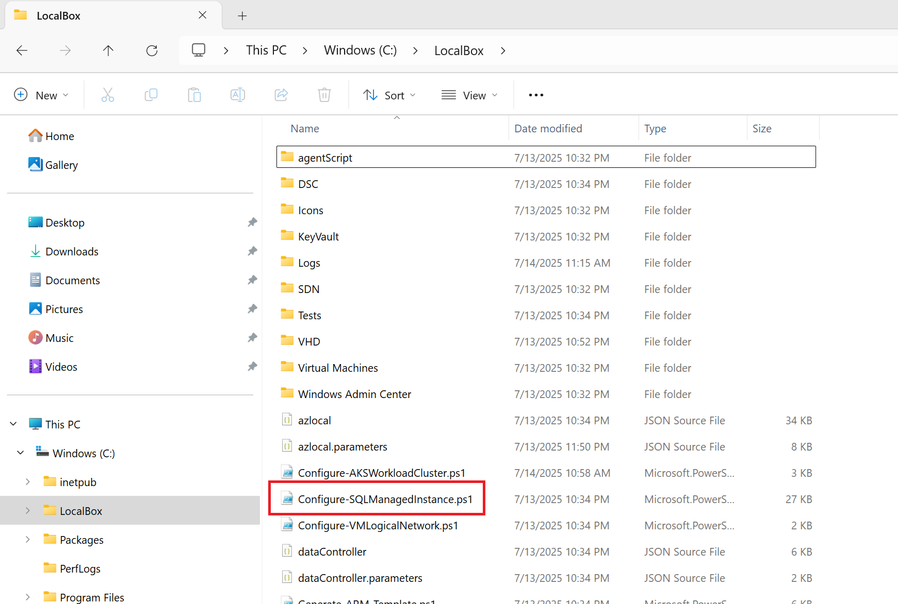

- PowerShell 7 コマンドライン ウィンドウを開き、_C:\LocalBox\_ ディレクトリに移動して _$PSVersionTable_ コマンドを実行し PowerShell バージョンを確認します。

  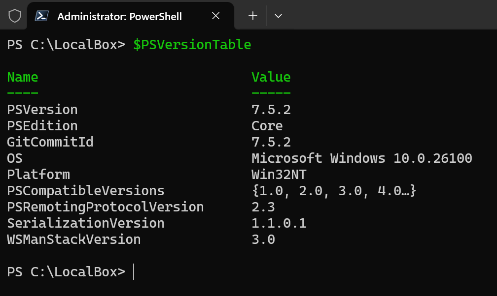

> [!IMPORTANT]
> 次のコマンドを実行する前に、以前のセッションで _az connectedk8s proxy_ コマンドを使用して作成されたプロキシが実行中でないことを確認してください。実行中の場合、競合が発生してスクリプトが失敗します。プロキシを閉じてデフォルトのプロキシ ポートが解放されるまで数分待ってください。

- コマンドラインで _Configure-SQLManagedInstance.ps1_ を実行し、手順に従って Azure にログインします。

  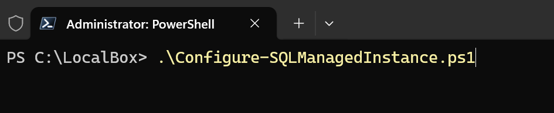

  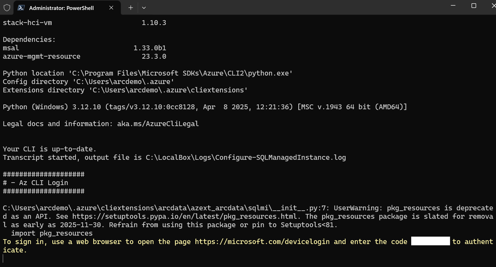

  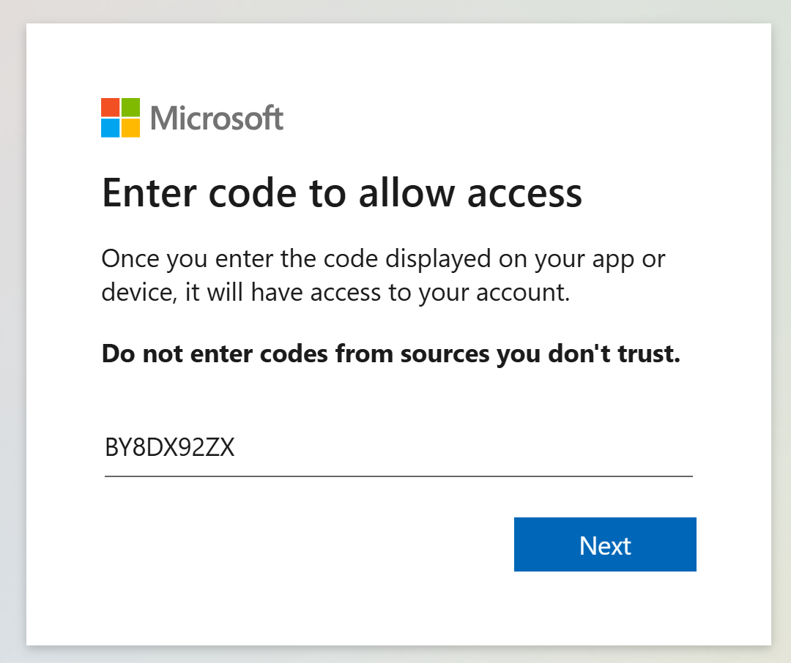

  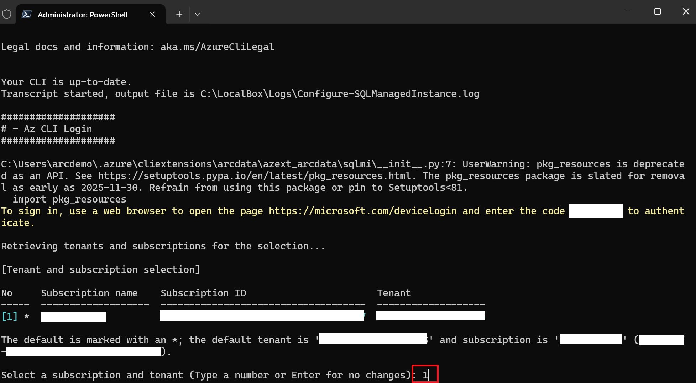

- スクリプトが完了するまで待ちます。約 20 分かかります。このスクリプトは Azure Local インスタンス上で以下を構成します。

  - AKS ノード サイズを Standard_D8s_v3 に拡大
  - AKS ノード プール数を 1 から 3 ノードに増加
  - ネットワーク拡張機能の作成
  - MetalLB 構成の作成
  - Azure Arc 対応 Data Services 拡張機能の作成
  - カスタム ロケーションの作成
  - Arc 対応 Data Controller の作成
  - Arc 対応 SQL Managed Instance の作成
  - Azure Local クラスターの AKS クラスターにデプロイされた SQL MI にアクセスするためのポート フォワード ルールの作成
  - SqlQueryStress ツールのインストール
  - Arc 対応 SQL Managed Instance への接続用デスクトップ ショートカットの作成

- このスクリプトが完了したら、リソース グループを開いて種類でグループ化し、LocalBox でデプロイされた Azure Arc 対応 SQL Managed Instance を確認します。

  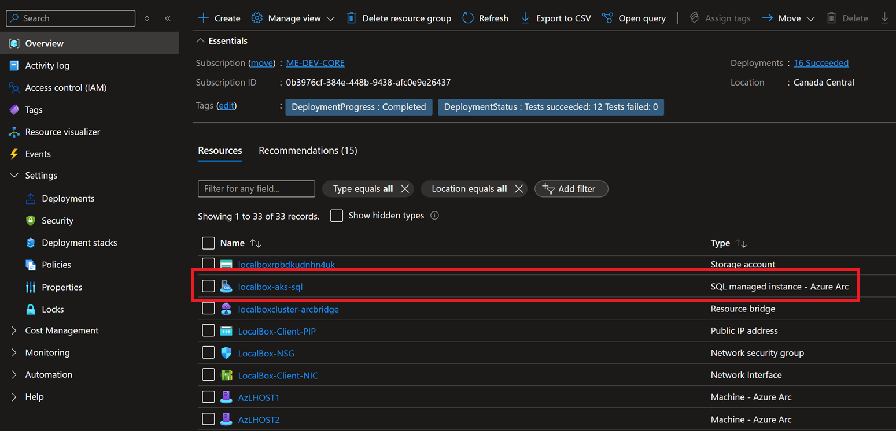

  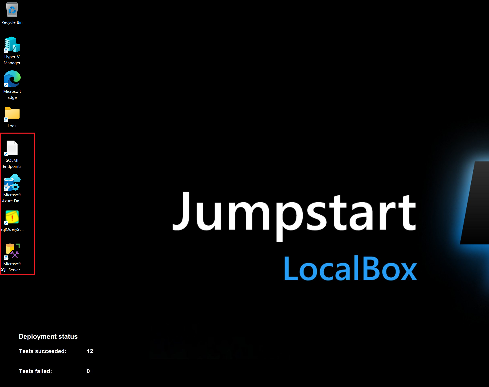

## Azure Data Studio を使用した Azure Arc 対応 SQL Managed Instance への接続

Azure Data Studio は _LocalBox-Client_ コンピューターにインストールされており、Arc 対応 SQL Managed Instance に接続して管理できるよう事前に構成されています。

- まず、_LocalBox-Client_ コンピューターのデスクトップにある Azure Data Studio ショートカットをクリックします。

  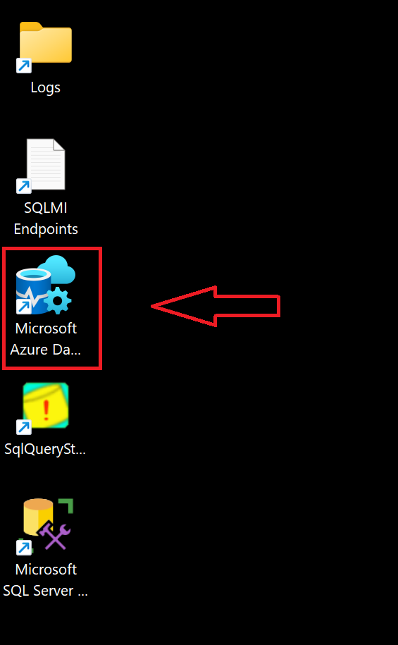

- 事前に構成された接続に接続し、「サーバー証明書を信頼する」をクリックします。

  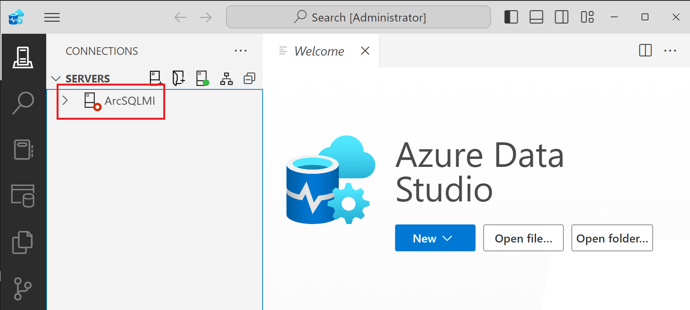

  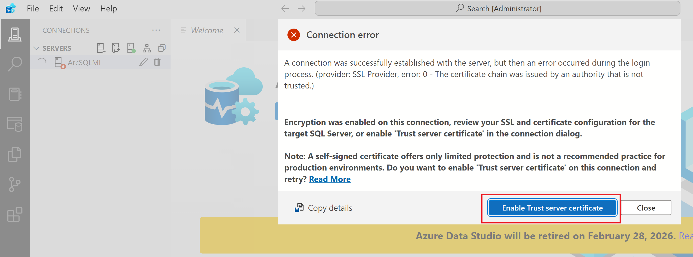

- 接続したら、サンプルの AdventureWorks データベースを参照できます。

  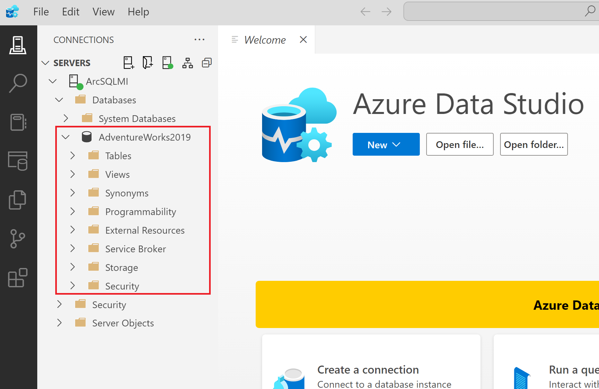

## Azure Arc 対応 SQL Managed Instance のストレス シミュレーション

LocalBox には、クライアント VM に自動的にインストールされる SqlQueryStress という専用の SQL ストレス シミュレーション ツールが含まれています。SqlQueryStress を使用すると、Azure Arc 対応 SQL Managed Instance に負荷を生成して、SQL データベースとサービスのパフォーマンスおよび Azure Local インスタンスの状態を確認できます。

- まず、SqlQueryStress デスクトップ ショートカットを開き、Arc 対応 SQL Managed Instance のプライマリ エンドポイント IP アドレスに接続します。これは作成されたデスクトップ ショートカット _SQLMI Endpoints_ テキスト ファイルに記載されています。

  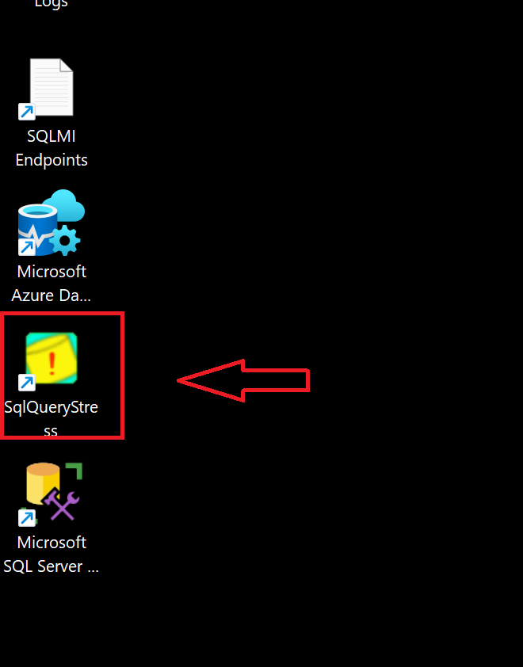

  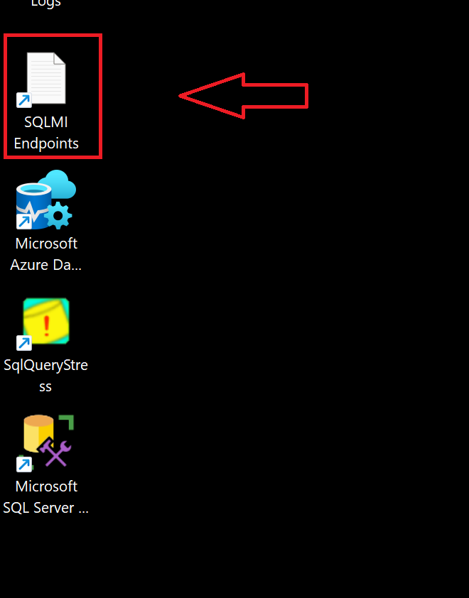

- 接続には「SQL Server 認証」を使用し、SQLMI エンドポイント ファイルの資格情報を使用して、デプロイされたサンプル AdventureWorks2019 データベースを選択します（「テスト」ボタンで接続を確認できます）。テストが成功したら「OK」をクリックします。

  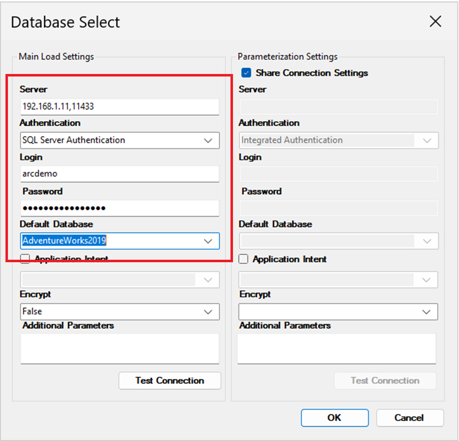

- 負荷を生成するには、単純なストアド プロシージャを実行します。以下のプロシージャをコピーし、実行するイテレーション数とスレッド数を変更してデータベースにさらに多くの負荷を生成します。さらに、ストアド プロシージャをしばらく実行できるようにクエリ間の遅延を 1 ms に変更します。「Go」をクリックして負荷の生成を開始します。

    ```sql
    exec [dbo].[uspGetEmployeeManagers] @BusinessEntityID = 8
    ```

- 以下の例に示すように、構成設定は 100,000 イテレーション、1 イテレーション当たり 5 スレッド、クエリ間の遅延 1 ms です。これらの構成により、ストレス テストをしばらく実行し続けることができます。

  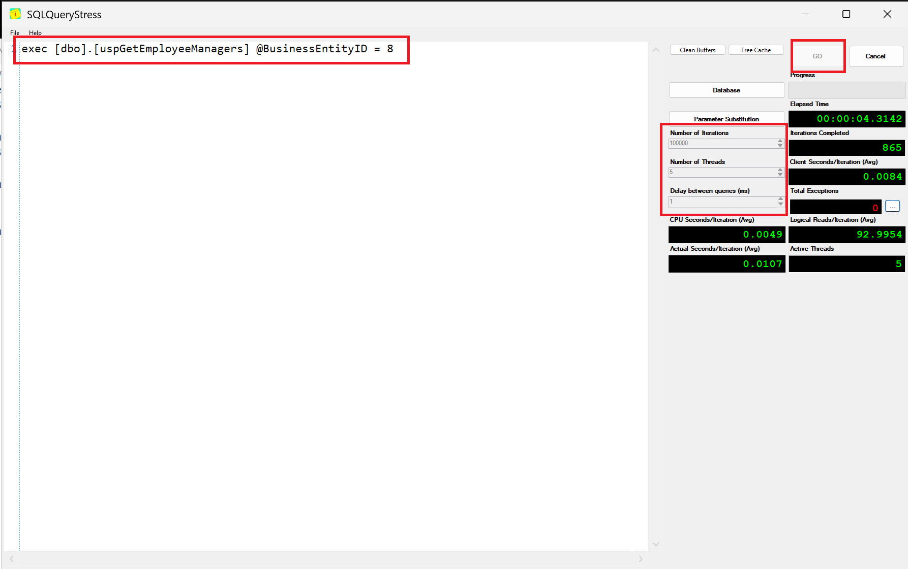

- Azure Local インスタンスのパフォーマンスを監視するには、Insights ブックをクリックしてクラスターのログを確認します。

    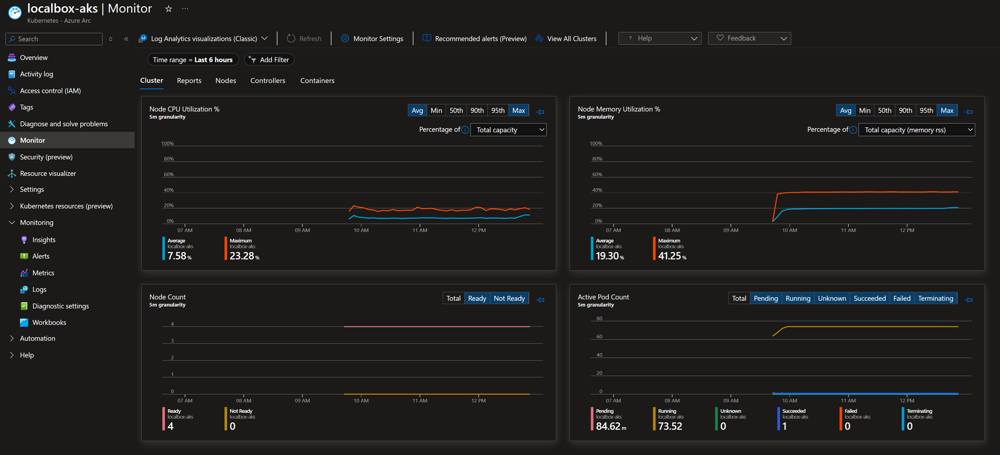

## 次のステップ

Azure Arc 対応 SQL Managed Instance には、ここでは直接取り上げていない多くの機能があります。[Azure Arc 対応 SQL Managed Instance](https://learn.microsoft.com/azure/azure-arc/data/managed-instance-overview) で旅を続けるためにドキュメントを確認してください。
