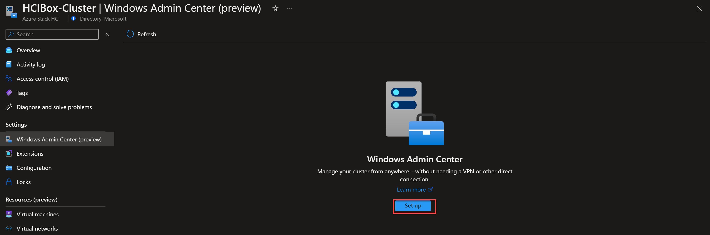
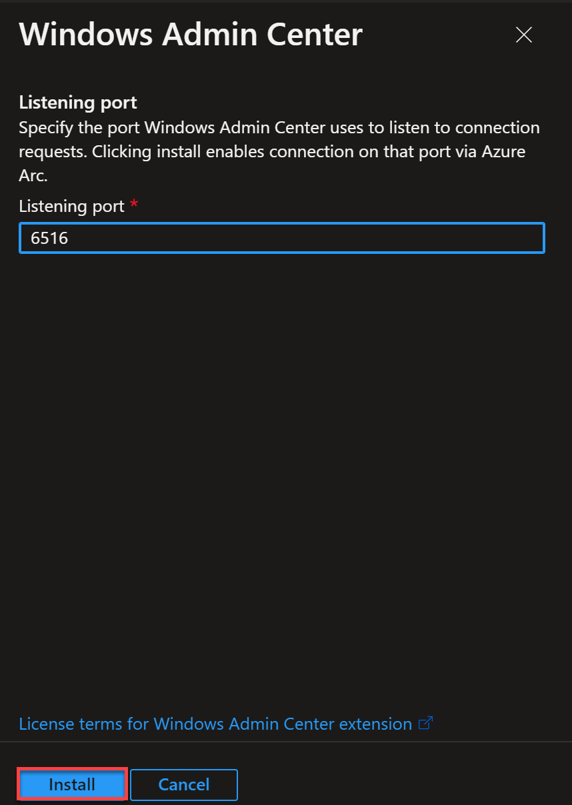
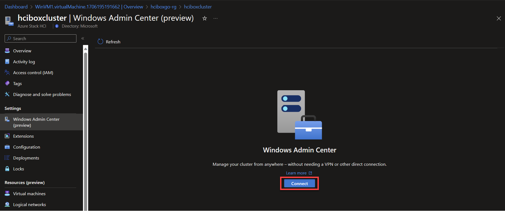
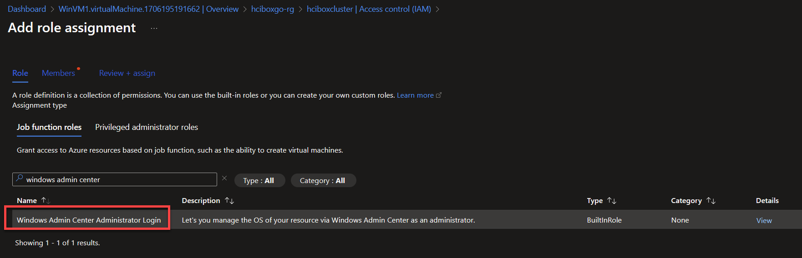
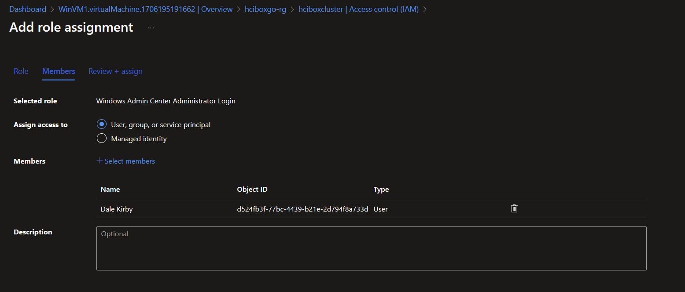
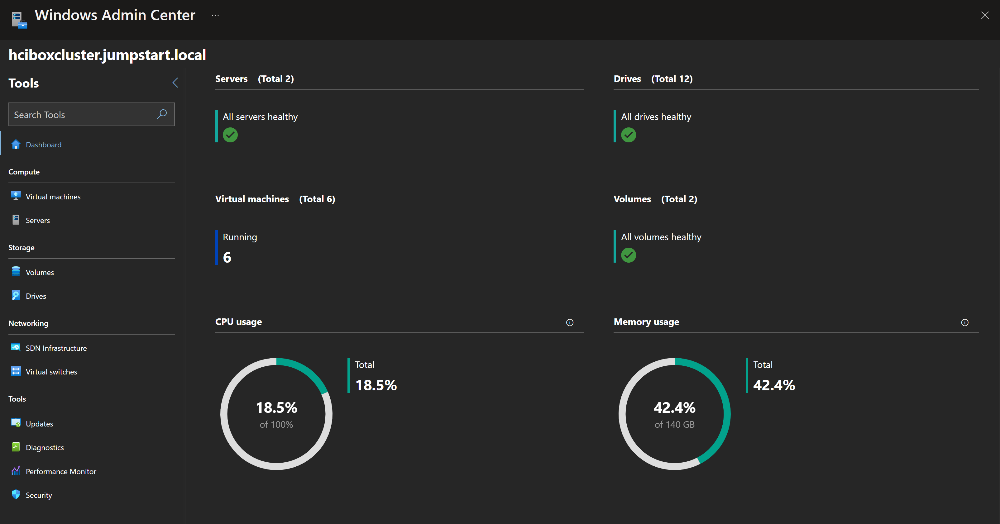

## Windows Admin Center の操作

Windows Admin Center（プレビュー）は Azure ポータル内から利用でき、LocalBox で使用できます。

## Azure ポータルの Windows Admin Center

Windows Admin Center は Azure ポータルから直接使用できます。LocalBox クラスター用にセットアップするには、次の手順に従います：

- _LocalBox-Cluster_ リソースに移動して、Windows Admin Center ブレードを選択します。

  

- ポートをデフォルト値のままにして「インストール」をクリックします。インストールが完了するまで数分かかります。

  

- インストールが完了したら、クラスター リソースの Windows Admin Center ブレードから「接続」をクリックします。

  

- Windows Admin Center に接続するには、ユーザーを「Windows Admin Center 管理者ログイン」Azure RBAC ロールに追加する必要があります。

  

  

- 完了したら、Azure ポータルの Windows Admin Center を使用してクラスターに接続できます。

  

## 次のステップ

Windows Admin Center の追加操作については、[公式ドキュメント](https://learn.microsoft.com/windows-server/manage/windows-admin-center/overview)を確認してください。
