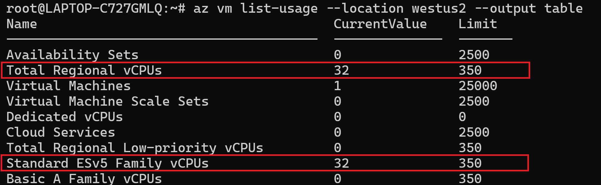
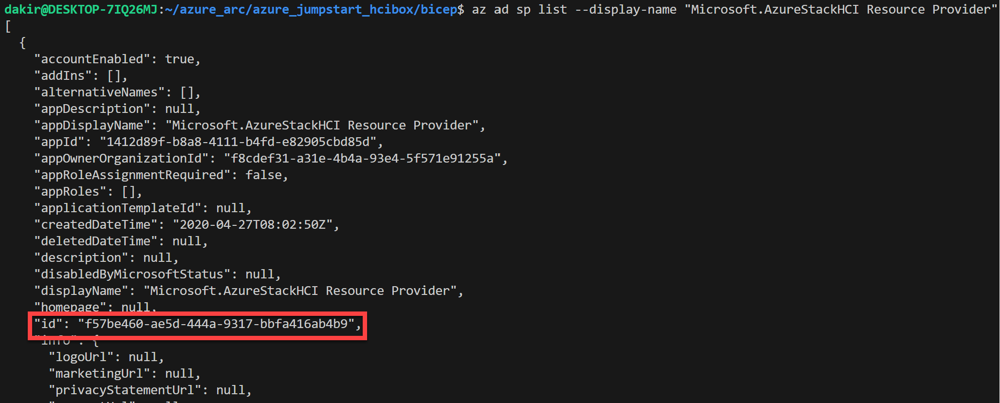
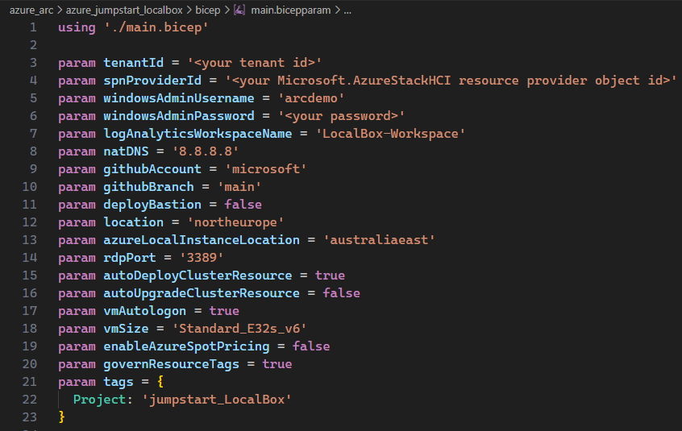
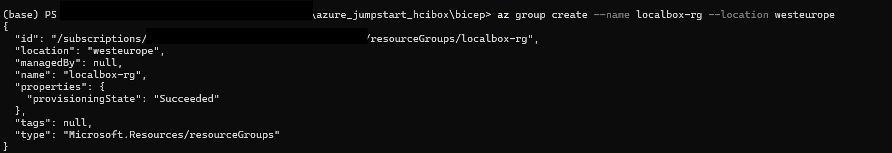
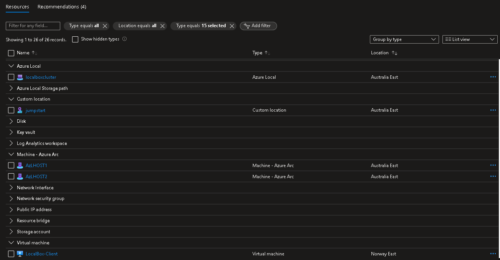

# Azure Bicep で LocalBox インフラストラクチャをデプロイする

## Azure Bicep

LocalBox は Azure Bicep を使用して Azure サブスクリプションにデプロイします。Azure CLI を使用して LocalBox をデプロイする方法については以下をお読みください。

### 環境の準備

- 必要な Azure リソース プロバイダーを登録します。Azure サブスクリプションが必要なリソース プロバイダーに登録されていることを確認してください。登録するにはサブスクリプションの所有者または共同作成者である必要があります。管理者に登録を依頼することもできます。

  次の PowerShell コマンドを実行して登録します：

  ```powershell
  Register-AzResourceProvider -ProviderNamespace "Microsoft.HybridCompute"
  Register-AzResourceProvider -ProviderNamespace "Microsoft.GuestConfiguration"
  Register-AzResourceProvider -ProviderNamespace "Microsoft.HybridConnectivity"
  Register-AzResourceProvider -ProviderNamespace "Microsoft.AzureStackHCI"
  Register-AzResourceProvider -ProviderNamespace "Microsoft.Kubernetes"
  Register-AzResourceProvider -ProviderNamespace "Microsoft.KubernetesConfiguration"
  Register-AzResourceProvider -ProviderNamespace "Microsoft.ExtendedLocation"
  Register-AzResourceProvider -ProviderNamespace "Microsoft.ResourceConnector"
  Register-AzResourceProvider -ProviderNamespace "Microsoft.HybridContainerService"
  Register-AzResourceProvider -ProviderNamespace "Microsoft.Attestation"
  Register-AzResourceProvider -ProviderNamespace "Microsoft.Storage"
  Register-AzResourceProvider -ProviderNamespace "Microsoft.Insights"
  Register-AzResourceProvider -ProviderNamespace "Microsoft.KeyVault"
  ```

  または Azure CLI を使用してこれらのプロバイダーを登録することもできます：

  ```shell
  az provider register --namespace Microsoft.HybridCompute
  az provider register --namespace Microsoft.GuestConfiguration
  az provider register --namespace Microsoft.HybridConnectivity
  az provider register --namespace Microsoft.AzureStackHCI
  az provider register --namespace Microsoft.Kubernetes
  az provider register --namespace Microsoft.KubernetesConfiguration
  az provider register --namespace Microsoft.ExtendedLocation
  az provider register --namespace Microsoft.ResourceConnector
  az provider register --namespace Microsoft.HybridContainerService
  az provider register --namespace Microsoft.Attestation
  az provider register --namespace Microsoft.Storage
  az provider register --namespace Microsoft.Insights
  az provider register --namespace Microsoft.Keyvault
  ```

- Arc Jumpstart GitHub リポジトリをクローンします

  ```shell
  git clone https://github.com/microsoft/azure_arc.git
  ```

- [Azure CLI をバージョン 2.65.0 以上にインストールまたは更新します](https://learn.microsoft.com/cli/azure/install-azure-cli?view=azure-cli-latest)。次のコマンドで現在インストールされているバージョンを確認できます。

  ```shell
  az --version
  ```

- *`az login`* コマンドを使用して Azure CLI にログインします。

- *`az account list --query "[?isDefault]"`* コマンドを使用して、LocalBox をデプロイするサブスクリプションが正しく選択されていることを確認します。Az CLI が使用するアクティブなサブスクリプションを変更する必要がある場合は、[このガイダンス](https://learn.microsoft.com/cli/azure/manage-azure-subscriptions-azure-cli#change-the-active-subscription)に従ってください。

> **注:** LocalBox は、選択した VM SKU（Standard E32s v5 または v6）に対して十分なコンピューティング容量（vCPU クォータ）があるリージョンであればどこにでもデプロイできます。デフォルト パラメーター（VM シリーズ/サイズなど）でデプロイする場合、32 個の ESv6 シリーズ vCPU が必要です。Azure サブスクリプションおよび LocalBox をデプロイする予定のリージョンに十分な vCPU クォータがあることを確認してください。以下の Azure CLI コマンドを使用して vCPU の使用状況を確認できます。

  ```shell
  az vm list-usage --location <your location> --output table
  ```

  

## Bicep テンプレートのデプロイ

- 最新の Bicep バージョンにアップグレードします

  ```shell
  az bicep upgrade
  ```

- ディレクトリの Azure Local リソース プロバイダーのオブジェクト ID を取得します。

  ```shell
  az ad sp list --display-name "Microsoft.AzureStackHCI Resource Provider"
  ```

  

> **注:** ```az ad sp list --display-name "Microsoft.AzureStackHCI Resource Provider"``` コマンドが空の配列を返す場合は、まず次のコマンドでプロバイダーを登録してください：```az provider register --namespace Microsoft.AzureStackHCI```

> **注:** `windowsAdminPassword` には $ 記号を使用しないでください。この記号を使用すると、LogonScript が失敗する可能性があります。

- [main.bicepparam](https://github.com/microsoft/azure_arc/blob/main/azure_jumpstart_localbox/bicep/main.bicepparam) テンプレート パラメーター ファイルを編集して、環境の値を指定します。

| 名前 | 型 | 説明 | 既定値 |
| --- | --- | --- | --- |
| `autoDeployClusterResource` | bool | クライアント VM のデプロイ完了後に Azure Local インスタンス リソースの自動デプロイを有効にするかどうかの選択。 | true |
| `autoUpgradeClusterResource` | bool | クライアント VM のデプロイ完了後に Azure Local インスタンス リソースの自動アップグレードを有効にするかどうかの選択。autoDeployClusterResource が true の場合のみ適用。 | false |
| `deployBastion` | bool | クライアント VM に接続するための Bastion をデプロイするかどうかの選択 | false |
| `githubAccount` | string | ターゲット GitHub アカウント | "microsoft" |
| `githubBranch` | string | ターゲット GitHub ブランチ | "main" |
| `governResourceTags` | bool | このパラメーターを `true` に設定すると、プロビジョニングされたリソースに `CostControl` および `SecurityControl` タグが追加されます。これらのタグは **Microsoft 内部の Azure ラボ テナント専用**であり、コスト最適化とセキュリティ制御に関連する自動ガバナンス プロセスの管理を目的としています。 | true |
| `location` | string | リソースをデプロイする場所 | リソース グループの場所 |
| `azureLocalInstanceLocation` | string | Azure Local インスタンスを登録するリージョン。Azure Local インスタンス リソースが作成されるリージョンです。サポートされている Azure Local リージョンのいずれかである必要があります：australiaeast,southcentralus,eastus,westeurope,southeastasia,canadacentral,japaneast,centralindia | australiaeast |
| `logAnalyticsWorkspaceName` | string | Log Analytics ワークスペースの名前 |  |
| `natDNS` | string | ドメインに使用するパブリック DNS | "8.8.8.8" |
| `rdpPort` | string | このパラメーターを使用してデフォルトの RDP ポートをオーバーライドします。デフォルトは 3389 です。クライアント VM への変更は行われません。 | "3389" |
| `spnProviderId` | string | _Microsoft.AzureStackHCI_ リソース プロバイダーの Entra ID オブジェクト ID |  |
| `tenantId` | string | サブスクリプションの Entra ID テナント ID |  |
| `tags` | object | すべてのリソースに追加するタグ | {"Project": "jumpstart_LocalBox"} |
| `vmAutologon` | bool | LocalBox クライアント VM への自動ログオンを有効にする | true |
| `windowsAdminPassword` | securestring | Windows アカウントのパスワード。パスワードには以下の 3 種類が含まれる必要があります：小文字 1 文字、大文字 1 文字、数字 1 文字、特殊文字 1 文字。値は 14 ～ 123 文字である必要があります。 |  |
| `windowsAdminUsername` | string | Windows アカウントのユーザー名 |  |
| `vmSize` | string | LocalBox クライアント VM のサイズ。有効な値：Standard_E32s_v5 および Standard_E32s_v6 | Standard_E32s_v6 |
| `enableAzureSpotPricing` | string | LocalBox クライアント VM の Azure VM スポット料金を有効にする | false |

  > **免責事項:** _governResourceTags_ パラメーターはオプションで、デフォルトで true に設定されています。指定しない場合、_CostControl: 'Ignore'_ と _SecurityControl: 'Ignore'_ の両方のタグ値が追加されます。これらのタグは **Microsoft 内部の Azure ラボ テナント専用**であり、コスト最適化とセキュリティ制御に関連する自動ガバナンス プロセスの管理を目的としています。_governResourceTags_ パラメーターが true に設定されている場合に**のみ**デプロイに追加されます。Microsoft 内部テナントと Azure サブスクリプションから LocalBox をデプロイする場合、このパラメーターを 'true' に設定することが必要です。そうしないと、デプロイに問題が発生し、失敗する可能性があります。

パラメーター ファイルの例：



- 新しいリソース グループを作成してから Bicep ファイルをデプロイします。ローカルにクローンした[デプロイ フォルダー](https://github.com/microsoft/azure_arc/tree/main/azure_jumpstart_localbox/bicep)に移動し、次のコマンドを実行します：

  ```shell
  az group create --name "<resource-group-name>"  --location "<location>"
  az deployment group create -g "<resource-group-name>" -f "main.bicep" -p "main.bicepparam"
  ```

  

## デプロイ後の自動化を開始する

デプロイが完了したら、Azure ポータルを開いてリソース グループ内の初期 LocalBox リソースを確認できます。次のデプロイ フェーズを続行するには、*LocalBox-Client* VM にリモート接続する必要があります。次の手順については、[Azure ポータルでのインスタンスのデプロイ方法](../cloud_deployment/#azure-ポータルから-azure-local-インスタンスの検証とデプロイを行う)に進んでください。

  

## デプロイのクリーンアップ

デプロイをクリーンアップするには、Azure CLI または Azure ポータルを使用してリソース グループを削除するだけです。

- Azure CLI を使用したクリーンアップ

  ```shell
  az group delete -n <name of your resource group>
  ```
