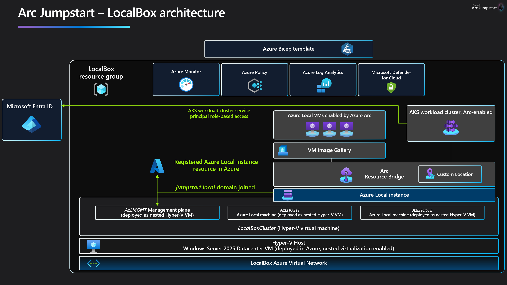
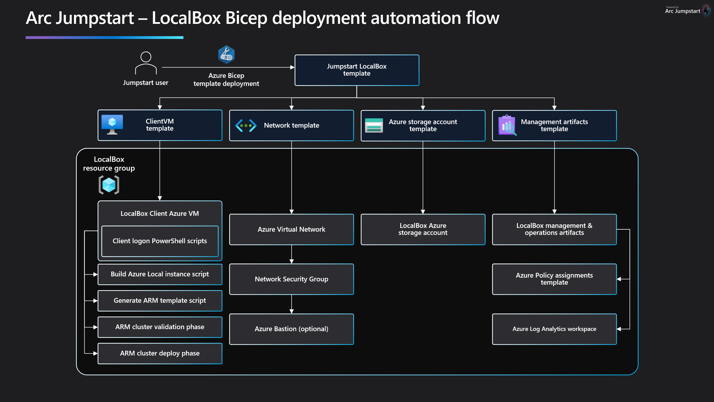

# LocalBox で Azure Local を評価する

## はじめに

LocalBox は、仮想化環境で [Azure Local](https://learn.microsoft.com/azure/azure-local/whats-new) の機能とハイブリッド クラウド統合を探索するための完全なサンドボックスをターンキーで提供するソリューションです。LocalBox は単一の Azure サブスクリプションとリソース グループ内に完全に自己完結するよう設計されており、物理ハードウェアを用意することなく Azure Local や [Azure Arc](https://learn.microsoft.com/azure/azure-arc/overview) テクノロジを実際に体験できます。

## ユースケース

- Azure Local と Azure Arc テクノロジを実際に操作するためのサンドボックス環境
- 概念実証 (PoC) やパイロットのアクセラレーター
- スキル開発のためのトレーニング ツール
- 顧客向けプレゼンテーションやイベントのデモ環境
- 迅速な統合テスト プラットフォーム

## LocalBox で利用できる Azure Local の機能

### 2 ノード Azure Local インスタンス

LocalBox は、Azure 仮想マシン上で動作する Hyper-V のネスト仮想化を使用して、2 ノードの Azure Local インスタンスを自動的に作成・構成します。この Hyper-V ホストは 3 つのゲスト仮想マシンを作成します。Azure Local マシン 2 台（_AzLHOST1_、_AzLHOST2_）と、ネスト Hyper-V ホスト 1 台（_AzLMGMT_）です。_AzLMGMT_ 自体が 2 つのゲスト VM をホストします。[Active Directory ドメイン コントローラー](https://learn.microsoft.com/windows-server/identity/ad-ds/get-started/virtual-dc/active-directory-domain-services-overview) と、仮想ルーターとして機能する [ルーティングとリモート アクセス サーバー](https://learn.microsoft.com/windows-server/remote/remote-access/remote-access) です。

### 仮想マシン管理

LocalBox には、[Azure ポータルでのゲスト VM 管理](https://learn.microsoft.com/azure/azure-local/manage/azure-arc-vm-management-overview)が含まれています。LocalBox のドキュメントでは、Azure Marketplace からの VM イメージの構成やインスタンス上への VM 作成など、この機能の使い方を説明します。

### Azure Arc 対応 AKS on Azure Local

Azure Local には、[AKS enabled by Azure Arc](https://learn.microsoft.com/azure/aks/aksarc/aks-overview) がデフォルト構成に含まれています。ワークロード インスタンスの作成に使用できるユーザー スクリプトが提供されています。

## LocalBox の Azure 消費コスト

LocalBox のリソースは、コア コンピューティング、ストレージ、ネットワーク、補助サービスなど、基盤となる Azure リソースから Azure 消費料金が発生します。Azure 消費コストは LocalBox をデプロイするリージョンによって異なる場合があります。LocalBox のデプロイを管理し、不要な課金を避けるために使用しないときは LocalBox リソースを無効化または削除してください。消費コストの詳細については [Jumpstart LocalBox FAQ](../faq/) を参照してください。

## デプロイ オプションとフロー

LocalBox は、必要な Azure リソースのデプロイと構成に [Bicep](https://learn.microsoft.com/azure/azure-resource-manager/bicep/overview?tabs=bicep) テンプレートをサポートしています。

LocalBox のデプロイは複数ステップのプロセスで構成されています。

1. Azure インフラストラクチャのデプロイ
2. 自動化スクリプトが仮想 Azure Local インスタンスを構成し ARM テンプレートを生成
3. ユーザーまたは自動化が ARM テンプレートをデプロイ（Azure Local インスタンスの検証フェーズ）
4. ユーザーまたは自動化が ARM テンプレートを再デプロイ（Azure Local インスタンスのデプロイ フェーズ）

## LocalBox のデプロイ

- [Azure Bicep で LocalBox をデプロイする](../deployment_az/)

LocalBox に関するその他の情報をお探しですか？

- [LocalBox に接続する](../cloud_deployment/)

- [LocalBox FAQ](../faq/)
