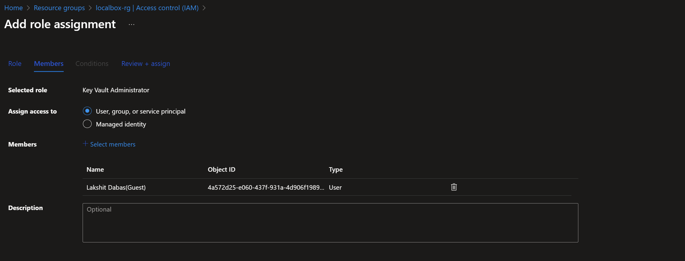
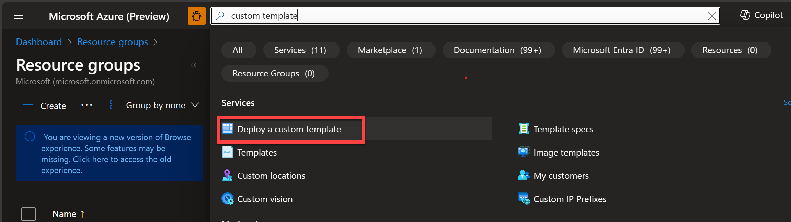
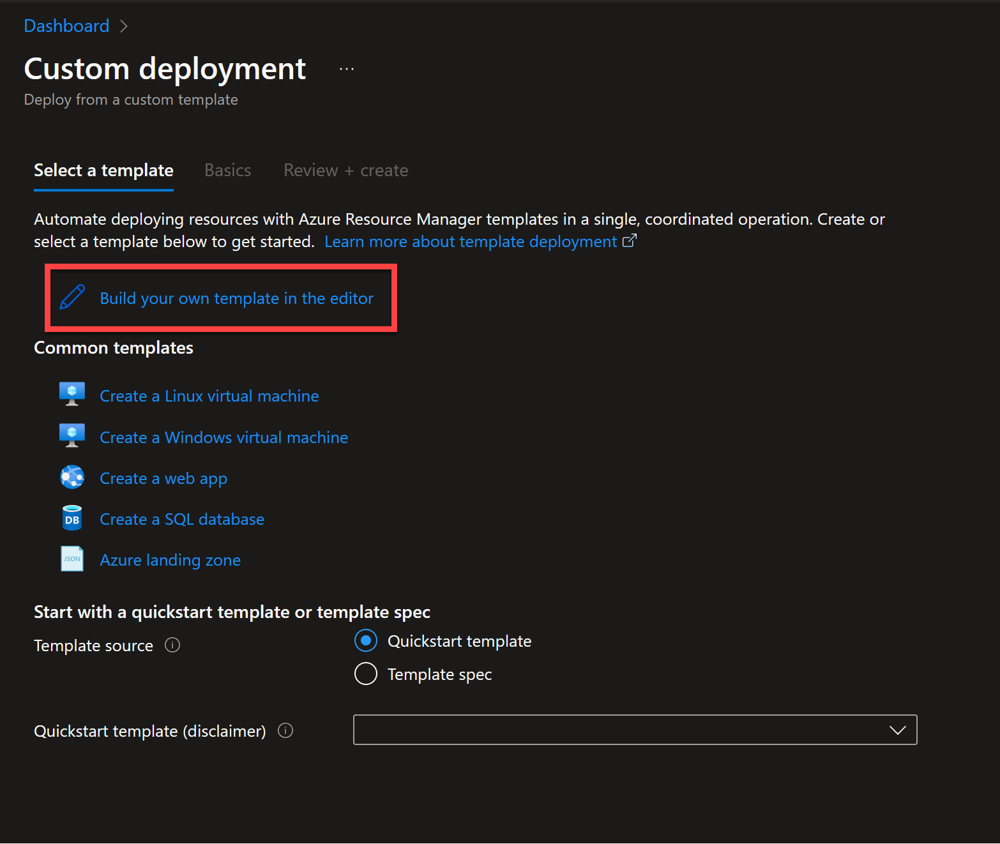
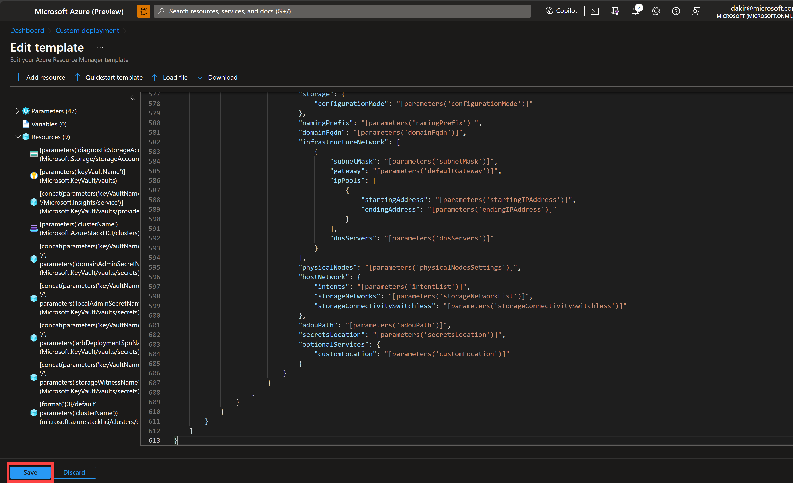
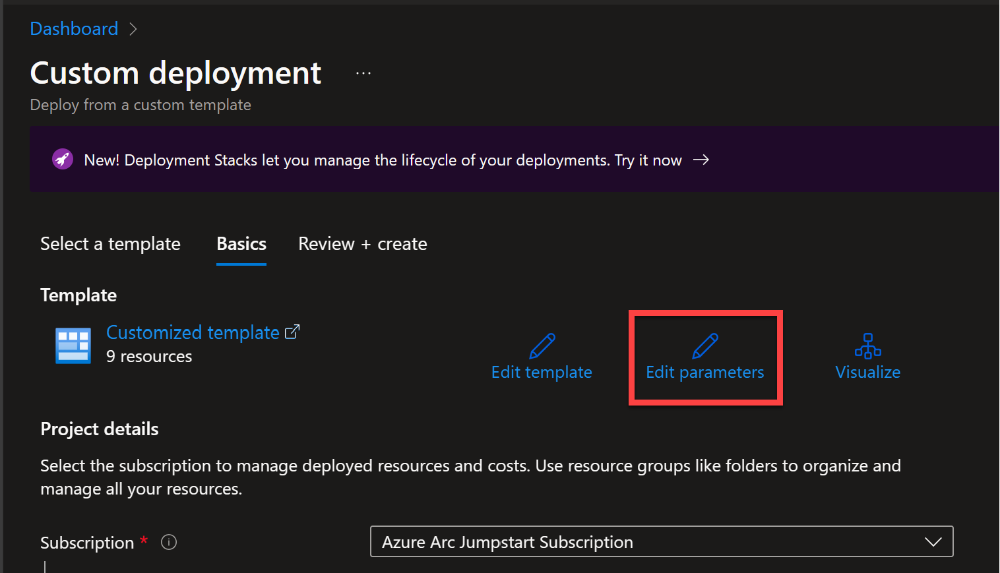
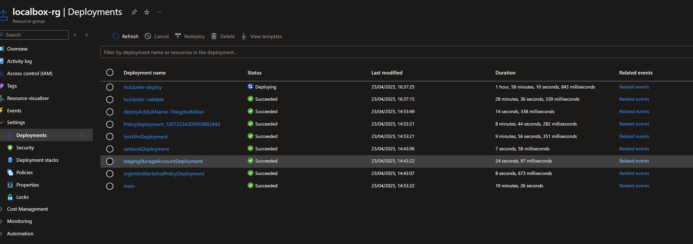
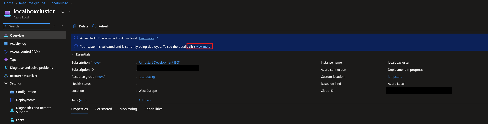
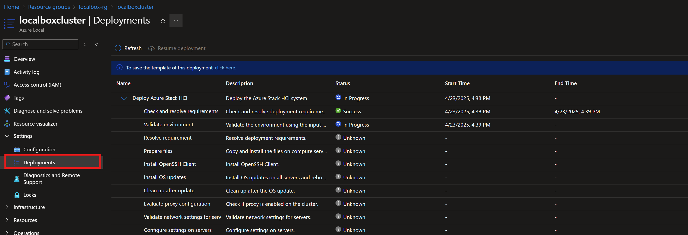
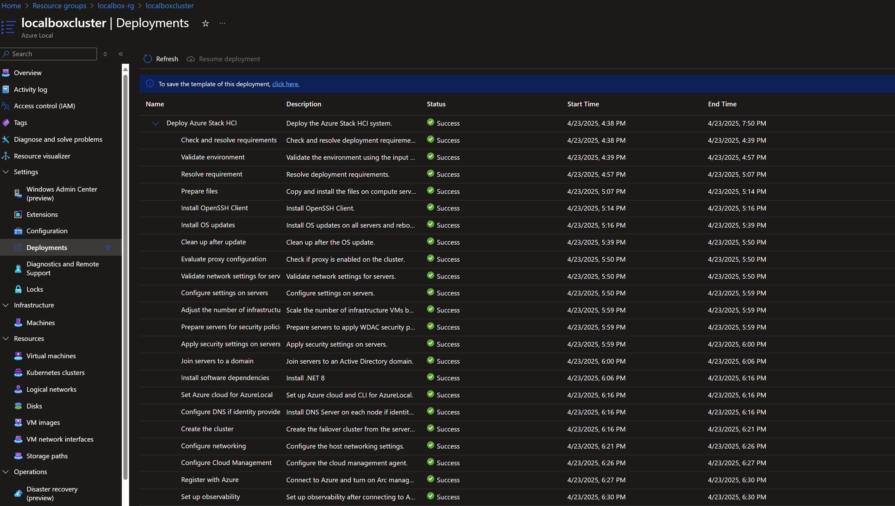
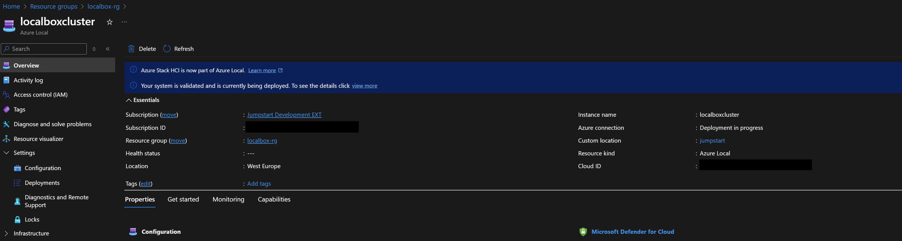

# Azure Local の手動デプロイ

> **重要:** デプロイ時に `autoDeployClusterResource` パラメーターを `false` に設定した場合は、このページの手順に従って Azure Local インスタンスを手動で検証およびデプロイしてください。これにより、Azure Local のデプロイ プロセスの各フェーズを実際に体験できます。

## 概要

手動デプロイでは、Azure Local の検証とデプロイ プロセスを段階的に実行でき、各フェーズをより詳細に制御および理解できます。Azure Local は ARM テンプレートを使用して Azure でインスタンスを作成・登録する 2 段階のプロセスを使用します。

1. **検証** - ARM テンプレートが「validate」フラグ付きでデプロイされます。これにより最終インスタンス検証ステップが開始され、約 20 分かかります。
2. **デプロイ** - 同じ ARM テンプレートが「deploy」フラグ付きで再デプロイされます。インスタンスと Arc インフラストラクチャをデプロイし、インスタンスを登録します。このステップには約 2 ～ 3 時間かかります。

## 前提条件

手動デプロイを進める前に、以下を確認してください：
- LocalBox インフラストラクチャのデプロイが正常に完了していること
- _LocalBox-Client_ VM にログインしていること

## Azure ポータルを使用した手動デプロイ

### 手順 1: 必要な権限を構成する

ARM デプロイを送信する前に、必要な権限でユーザー アカウントを追加する必要があります：

- Azure ポータルで LocalBox リソース グループに移動します
- 「アクセス制御 (IAM)」をクリックし、「ロールの割り当ての追加」をクリックします
- 「Key Vault 管理者」ロールを選択し、ユーザー アカウントを選択してロールを割り当てます

  

- この手順を繰り返して、LocalBox リソース グループに対して「ストレージ アカウント共同作成者」としてユーザー アカウントを追加します

### 手順 2: ARM テンプレートを準備する

- _LocalBox-Client_ VM でエクスプローラーを開き、_C:\LocalBox_ フォルダーに移動します
- フォルダーを右クリックして VSCode で開きます
- `azlocal.json` および `azlocal.parameters.json` ファイルを開いて確認します
- `azlocal.parameters.json` ファイルに「_-staging_」プレースホルダーのパラメーター値がなく、正しく見えることを確認します

### 手順 3: Azure ポータルでインスタンスを検証する

- Azure ポータルに移動し、検索バーに「カスタム デプロイ」と入力します
- 「カスタム テンプレートのデプロイ」を選択します

  

- 「エディターで独自のテンプレートを作成する」を選択します

  

- エディターに `azlocal.json` の内容を貼り付けて「保存」をクリックします

  

- 「パラメーターの編集」をクリックし、エディターに `azlocal.parameters.json` の内容を貼り付けて「保存」をクリックします

  

- 「作成」をクリックし、「確認と作成」をクリックしてインスタンス デプロイの検証フェーズを開始します

  

- 検証が完了するまで（約 20 分）進行状況を監視します

### 手順 4: Azure ポータルでインスタンスをデプロイする

- 検証が完了したら、LocalBox リソース グループのインスタンス リソースに移動します
- バナーにインスタンスが検証済みでまだデプロイされていないことが表示されます
- 「今すぐデプロイ」リンクをクリックします

  

- クリックしてデプロイを送信します
- インスタンスのデプロイには 2 ～ 3 時間かかる場合があります
- インスタンスの「デプロイ」タブで進行状況を監視します（最新の状態を取得するには「更新」をクリックします）

  

## デプロイ完了の確認

- LocalBox リソース グループでクラスター リソース `localboxcluster` を開きます
- `設定` -> `デプロイ` に移動します
- すべての手順が正常に完了していることを確認します

  

LocalBox インスタンスのデプロイが完了したら、さまざまな LocalBox の機能を探索し始めましょう。次の手順については [LocalBox の使用](../using_localbox/) ガイドに進んでください。

  

## 手動デプロイのトラブルシューティング

手動デプロイ中に問題が発生した場合は、デプロイの問題とログ分析については [トラブルシューティング](../troubleshooting/) ガイドを参照してください。
