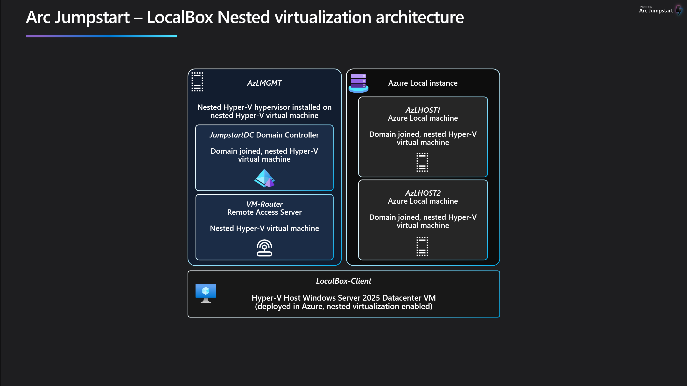
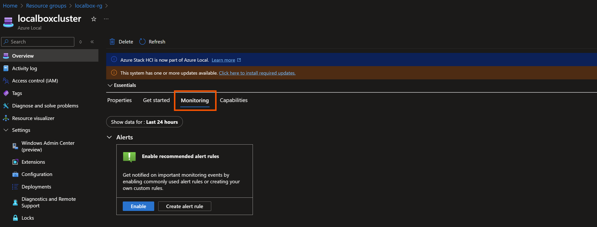
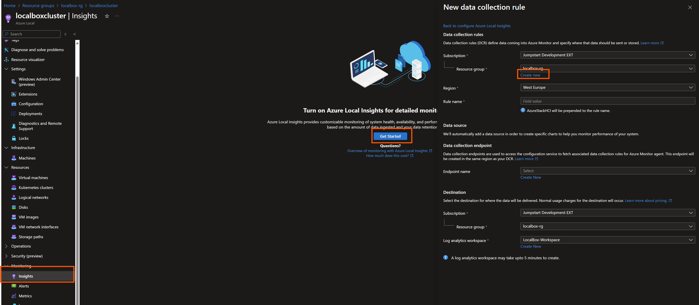
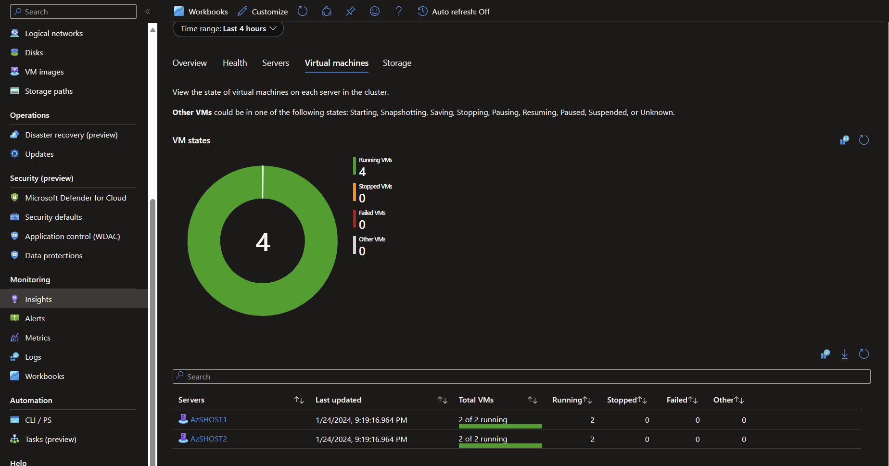
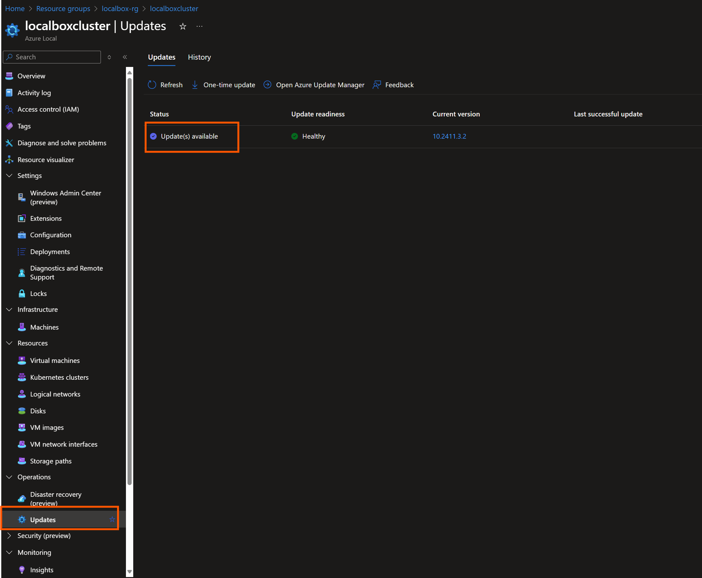
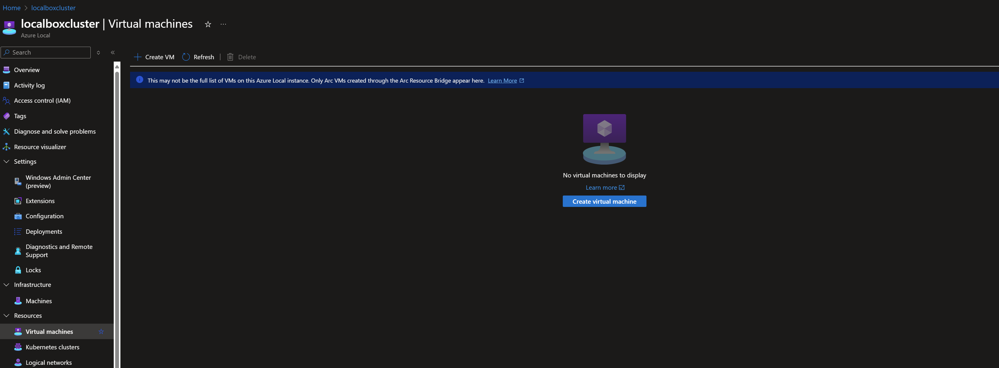
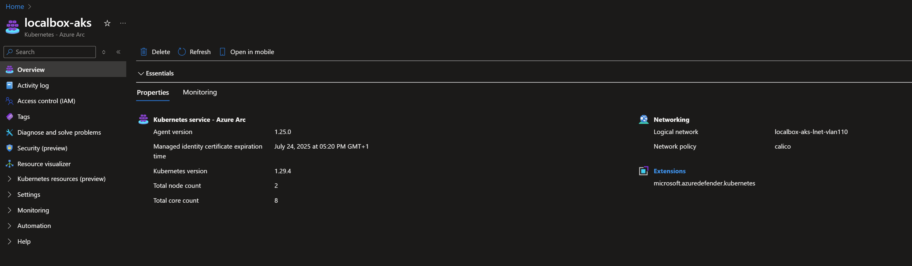
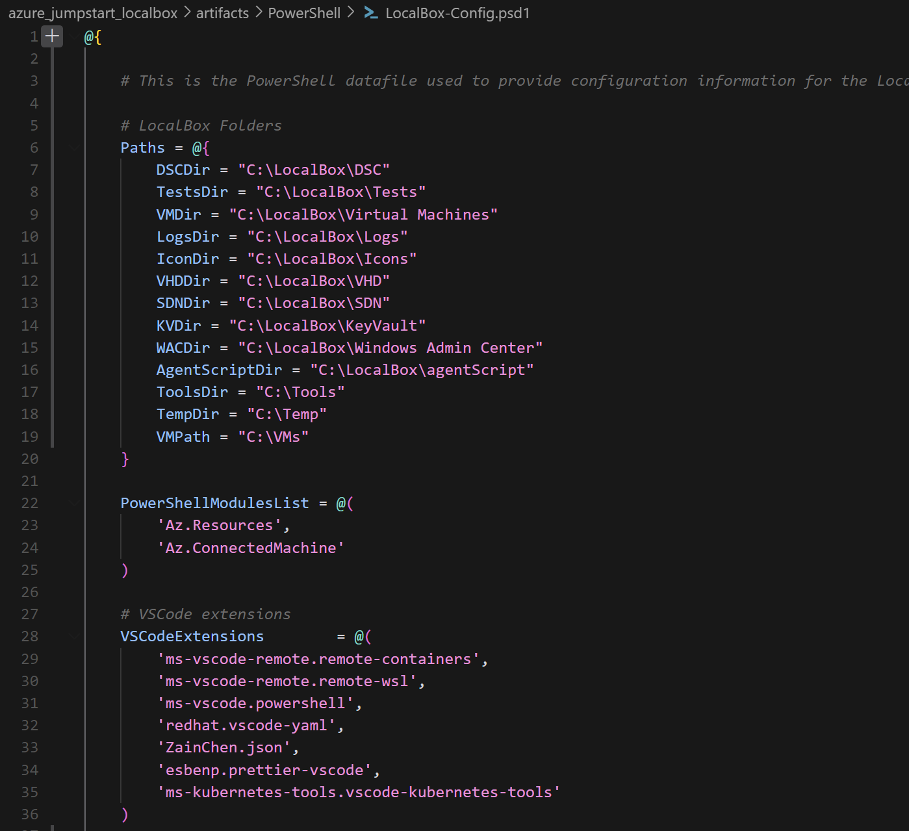

# LocalBox の評価

## LocalBox の使用方法

LocalBox には、Azure ポータルから、または _LocalBox-Client_ 仮想マシン内部から探索できる多くの機能があります。含まれているすべての機能を把握するために、以下のセクションを読んで一般的なアーキテクチャとさまざまな機能の使い方を理解してください。

## ネスト仮想化

LocalBox は [Hyper-V のネスト仮想化](https://learn.microsoft.com/virtualization/hyper-v-on-windows/user-guide/nested-virtualization)を使用して、Azure Local の 2 ノード物理デプロイをシミュレートします。LocalBox で最高のエクスペリエンスを得るために、ソリューションを構成するさまざまなネスト VM の詳細を確認してください。

  

| コンピューター名        | 役割                                | ドメイン参加 | 親ホスト          | OS                  |
| ---------------- | ----------------------------------- | ------------- | --------------- | ------------------- |
| _LocalBox-Client_  | プライマリ ホスト                    | いいえ        | Azure           | Windows Server 2025 |
| _AzLHOST1_       | Azure Local マシン                  | はい          | _LocalBox-Client_ | Azure Local     |
| _AzLHOST2_       | Azure Local マシン                  | はい          | _LocalBox-Client_ | Azure Local     |
| _AzLMGMT_        | ネスト ハイパーバイザー             | いいえ        | _LocalBox-Client_ | Windows Server 2022 |
| _JumpstartDC_    | ドメイン コントローラー             | はい（DC）    | _AzLMGMT_       | Windows Server 2022 |
| _Vm-Router_      | リモート アクセス サーバー          | いいえ        | _AzLMGMT_       | Windows Server 2022 |

## Active Directory ドメイン ユーザーの資格情報

デプロイ時にテンプレート パラメーターで指定したローカル管理者の資格情報を使用して _LocalBox-Client_ VM にログインしたら、Azure Local ノードへのログインなど、ほとんどの他の機能にアクセスするためにドメイン アカウントに切り替える必要があります。デフォルトのドメイン アカウントは _administrator@jumpstart.local_ です。

  > **注:** このアカウントのパスワードは、デプロイ時にローカル アカウントに指定したものと同じパスワードが設定されています。多くの LocalBox 操作では、資格情報が必要な場合はドメイン アカウントが使用されます。

## Azure Local の監視

Azure Local は [Azure Monitor](https://learn.microsoft.com/azure/azure-local/manage/monitor-hci-single) と統合されており、Azure ポータルを通じて Azure Local インスタンス インサイトの監視をサポートします。以下の手順に従って LocalBox インスタンスの監視を構成してください。

- インスタンスの「概要」ブレードを開き、プラットフォーム監視がデフォルトで利用可能であることを確認します。

  

- _LocalBox-Cluster_ リソースの「概要」ブレードから、「機能」タブを選択し、「Insights」をクリックして「はじめに」をクリックします。ウィザードに従って新しいデータ収集ルールとデータ収集エンドポイントを作成します。

  

- ログ データが Insights に流れるまでに時間がかかります。データが利用可能になったら、_LocalBox-Cluster_ リソースの「Insights」ブレードをクリックして Insights ブックを表示し、インスタンスのログを確認します。

  

## Azure Local のアップグレード

LocalBox は、インストール メディアの最新利用可能バージョンで定期的に更新されます。製品グループはセキュリティ修正と機能改善を含む更新プログラムを定期的に公開しており、最新の LocalBox 更新後にリリースされる場合があります。このため、Azure Local インスタンスの初回デプロイ後に更新プログラムをトリガーする必要がある場合があります。

デプロイ完了後に Azure Local インスタンスの自動アップグレードを有効にするために `autoUpgradeClusterResource` パラメーターを有効にした場合、すでに利用可能な最新バージョンが適用されているはずです。

そうでない場合は、利用可能な更新プログラムを確認することをお勧めします。

  

_ステータス_ 列が _最新_ を示していない場合は、「1 回限りの更新」をクリックして更新プロセスをトリガーできます。

Azure Local の更新に関する詳細については、[製品ドキュメント](https://learn.microsoft.com/azure/azure-local/update/about-updates-23h2)を参照してください。

## Azure ポータルを通じた仮想マシン管理

Azure Local は [Azure ポータルを通じた VM 管理](https://learn.microsoft.com/azure/azure-local/manage/azure-arc-vm-management-overview)をサポートしています。[LocalBox VM プロビジョニング ドキュメント](../RB/) を開いて始めてください。

## Azure Kubernetes Service（AKS）

LocalBox には [AKS enabled by Azure Arc](https://learn.microsoft.com/azure/aks/aksarc/aks-overview) が事前に構成されています。[Azure Local LocalBox 上の Azure Kubernetes Service ドキュメント](../AKS/) を開いて現在利用可能な機能を探索してください。

## 高度な構成

LocalBox のデフォルト構成を変更したいユーザーもいるかもしれません。多くの設定は [_LocalBox-Config.psd1_](https://github.com/microsoft/azure_arc/blob/main/azure_jumpstart_Localbox/artifacts/PowerShell/LocalBox-Config.psd1) PowerShell ファイルの値を変更することで構成できます。このファイルに変更を加える場合は、Jumpstart リポジトリをフォークしてフォーク内で変更を行い、オプションの _githubAccount_ および _githubBranch_ デプロイ テンプレート パラメーターをフォークを指すように設定する必要があります。

  > **注:** 高度な構成のデプロイは Jumpstart チームではサポートされていません。_LocalBox-Config.psd1_ ファイルへの変更により、LocalBox デプロイのいずれかの時点で失敗が発生する可能性があります。変更の影響を理解している場合にのみ、このファイルに変更を加えてください。

## 次のステップ

LocalBox は、テストやトレーニングの環境、概念実証プロジェクトのジャンプスタートなど、さまざまなユースケースに使用できるサンドボックスです。LocalBox で何でも自由に行ってください。LocalBox で試してみる次のステップの提案：

- Azure ポータルから Windows Admin Center を探索する
- Azure Arc 対応 Kubernetes で GitOps 構成をデプロイする
- Azure Arc 対応リソースに適用するポリシー イニシアティブを構築する
- Azure Arc 対応リソースに適用するカスタム ポリシーを作成してテストする
- 外部ソリューションや概念実証のための自動化を再利用する
